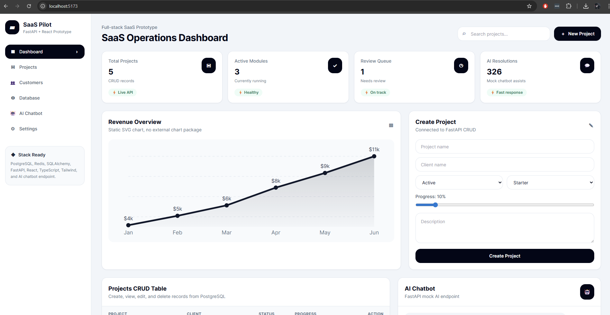

# SaaS Prototype: FastAPI + React + PostgreSQL + Redis + Docker 

## Author

Developed by Gregorio Godin Jr.

## UI Preview



This is a runnable SaaS prototype with:

- Backend: Python, FastAPI, SQLAlchemy, PostgreSQL, Redis-ready configuration
- Frontend: React, TypeScript, Tailwind CSS, Vite
- Features: Dashboard, Projects CRUD, AI Chatbot mock endpoint
- Docker Compose setup

## Project Structure

```txt
saas_full_prototype/
  backend/
    app/
      api/
      core/
      models/
      schemas/
      services/
    Dockerfile
    requirements.txt
    .env.example
  frontend/
    src/
      components/
      pages/
      services/
    Dockerfile
    package.json
    tailwind.config.js
  docker-compose.yml
  README.md
```

## Quick Start with Docker

```bash
docker compose up --build
```

Then open:

- Frontend: http://localhost:5173
- Backend API docs: http://localhost:8000/docs
- Health check: http://localhost:8000/health

## Manual Backend Setup

```bash
cd backend
python -m venv .venv
# Windows
.venv\Scripts\activate
# macOS/Linux
source .venv/bin/activate

pip install -r requirements.txt
cp .env.example .env
uvicorn app.main:app --reload
```

## Manual Frontend Setup

```bash
cd frontend
npm install
npm run dev
```

## API Endpoints

Base URL:

```txt
http://localhost:8000/api/v1
```

### Projects CRUD

```txt
GET    /projects
GET    /projects/{id}
POST   /projects
PUT    /projects/{id}
DELETE /projects/{id}
```

### Dashboard

```txt
GET /dashboard/stats
```

### AI Chatbot Mock

```txt
POST /chat
```

Sample request:

```json
{
  "message": "Summarize project health"
}
```

## Notes

- Database tables are auto-created during backend startup for prototype speed.
- Redis is configured and health-checkable; you can add caching later.
- AI chatbot is a mock endpoint. Replace the service implementation with OpenAI, Azure OpenAI, or another LLM provider later.
